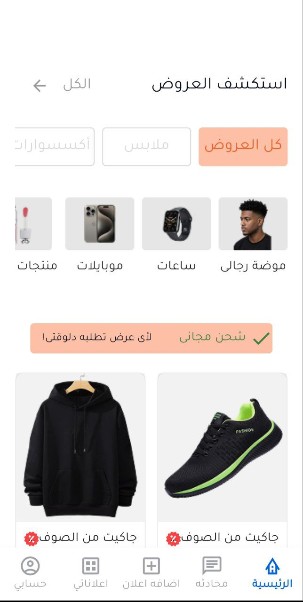
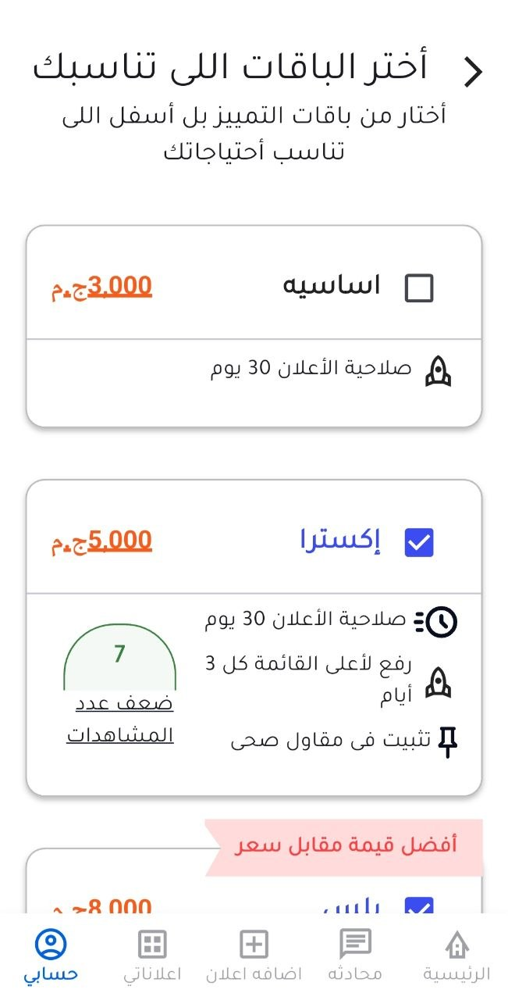
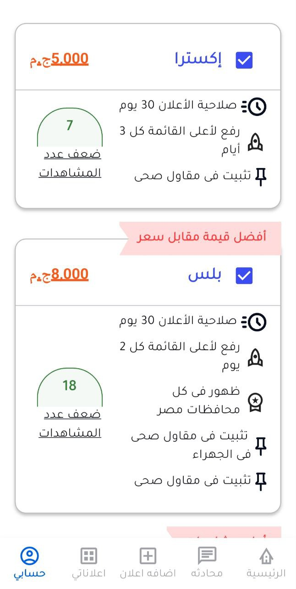
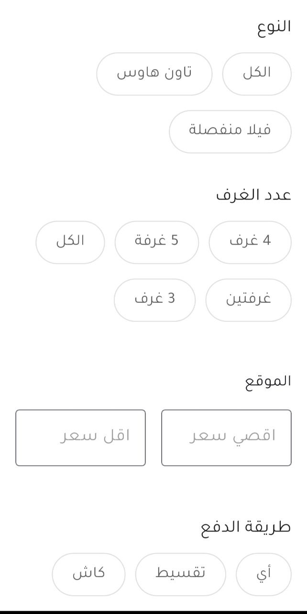
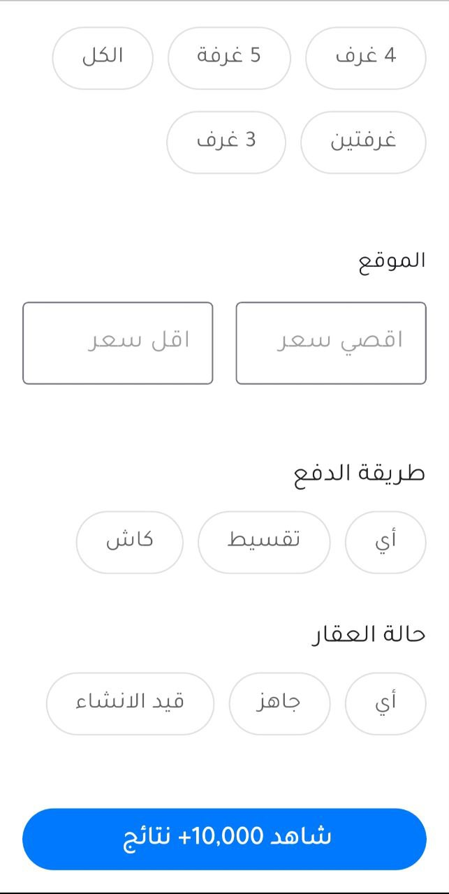
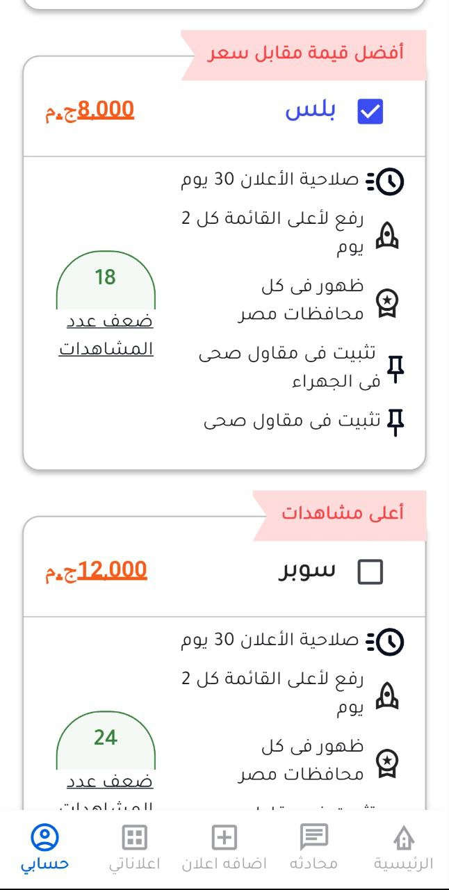
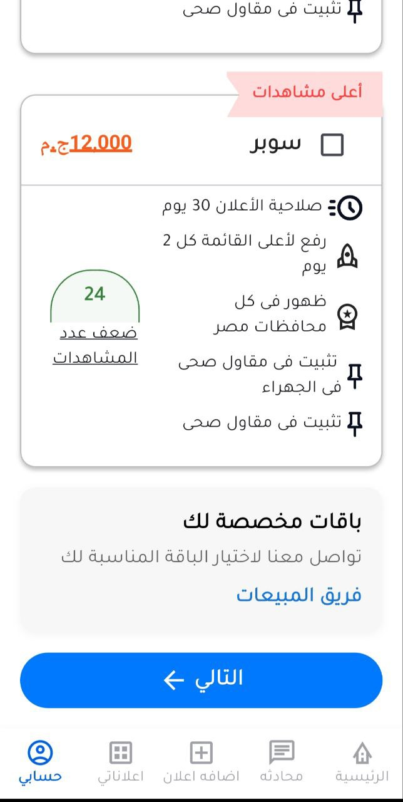
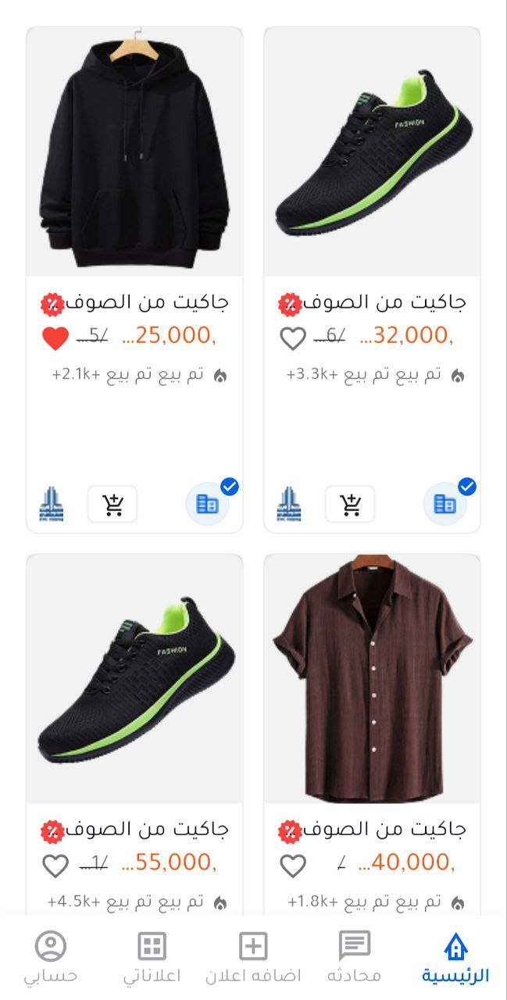

# Karim Flutter Task


## 📱 Screenshots



















## 🛠️ Tools & Technologies Used

### State Management
- **flutter_bloc** (^9.1.1) - State management using BLoC pattern for managing app state and business logic

### Database
- **sqflite** (^2.4.2) - SQLite database for local data storage
- **path** (^1.9.1) - Path manipulation utilities for database file handling

### UI Components
- **flutter_svg** (^2.2.1) - SVG image rendering 

### Assets
- **Custom Fonts** - Tajawal font family for Arabic text support
- **SVG Icons** - Scalable vector graphics for UI elements
- **Product Images** - High-quality product photos
- **Category Images** - Category-specific imagery

## 🏗️ Architecture

The app follows a clean architecture pattern with:

- **Feature-based structure** - Organized by business features
- **BLoC pattern** - For state management and business logic separation
- **Repository pattern** - For data access abstraction
- **Model classes** - For data representation with JSON serialization
- **Widget composition** - Reusable UI components

## 📁 Project Structure

```
lib/
├── core/
│   └── utils/           # Database helper and utilities
├── features/
│   ├── offers_feature/  # Product listings and categories
│   ├── plans_selected_feature/  # Subscription plans
│   └── filtring_feature/  # Search and filtering
└── main.dart           # App entry point
```

## 📋 Features

- **Product Catalog** - Browse products with categories
- **Subscription Plans** - Multiple pricing tiers
- **Arabic Support** - RTL layout with custom fonts


## 🎨 Design

- Arabic typography with Tajawal font
- SVG icons for crisp graphics
- Card-based layouts for modern look